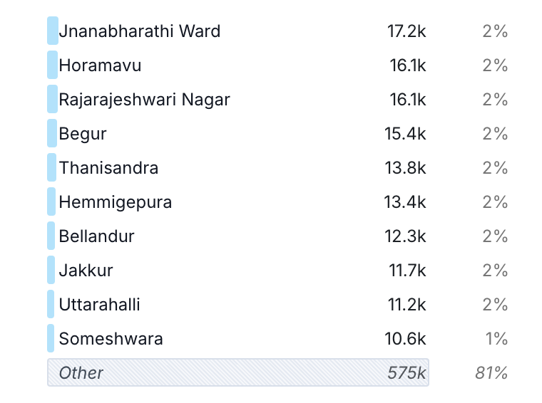
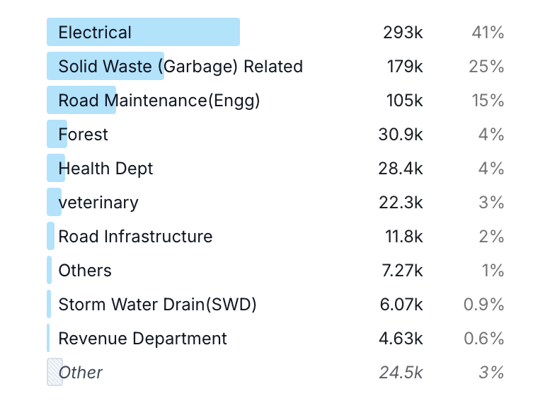

# bbmp-citizen-grievances

Dataset of citizen grievances filed on the Sahaaya 2.0 portal by BBMP. Sourced from the [Bengaluru Smart City Limited Website](https://smartoneblr.com/NicApplicationStatus.htm).

Explore the dataset [here](https://hyparam.github.io/demos/hyparquet/?key=https%3A%2F%2Fgithub.com%2FVonter%2Fbbmp-citizen-grievances%2Freleases%2Fdownload%2Fbbmp-citizen-grievances%2Fcitizen-grievances.parquet).

## Data

* [citizen-grievances.parquet](https://github.com/Vonter/bbmp-trade-license/releases/latest/download/citizen-grievances.parquet): Citizen grievance details such as Grievance Category, Grievance Date, Ward, Grievance Status, as Parquet file.
* [citizen-grievances.csv.gz](https://github.com/Vonter/bbmp-trade-license/releases/latest/download/citizen-grievances.csv.gz): Citizen grievance details such as Grievance Category, Grievance Date, Ward, Grievance Status, as compressed CSV file.

For more details, refer to the [DATA.md](DATA.md).

## Visualizations

#### Top wards



#### Top categories



## Scripts

- [fetch.py](fetch.py) Fetches the raw HTMLs for the citizen grievances
- [parse.py](parse.py): Parses the raw HTMLs to generate the Parquet and compressed CSV dataset

## License

This bbmp-citizen-grievances dataset is made available under the Open Database License: http://opendatacommons.org/licenses/odbl/1.0/. 
Some individual contents of the database are under copyright by BBMP.

You are free:

* **To share**: To copy, distribute and use the database.
* **To create**: To produce works from the database.
* **To adapt**: To modify, transform and build upon the database.

As long as you:

* **Attribute**: You must attribute any public use of the database, or works produced from the database, in the manner specified in the ODbL. For any use or redistribution of the database, or works produced from it, you must make clear to others the license of the database and keep intact any notices on the original database.
* **Share-Alike**: If you publicly use any adapted version of this database, or works produced from an adapted database, you must also offer that adapted database under the ODbL.
* **Keep open**: If you redistribute the database, or an adapted version of it, then you may use technological measures that restrict the work (such as DRM) as long as you also redistribute a version without such measures.

## Generating

Ensure that `python` and the required dependencies in `requirements.txt` are installed.

```
# Fetch the citizen grievances
python fetch.py

# Parse the citizen grievances
python parse.py
```

## Credits

- [BBMP](https://smartoneblr.com/NicApplicationStatus.htm)

## AI Declaration

Components of this repository, including code and documentation, were written with assistance from Claude AI.